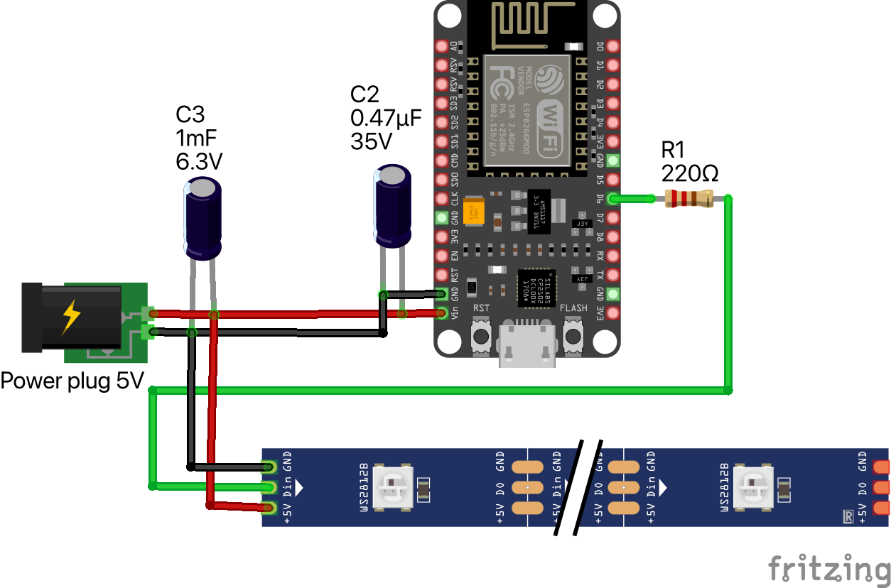
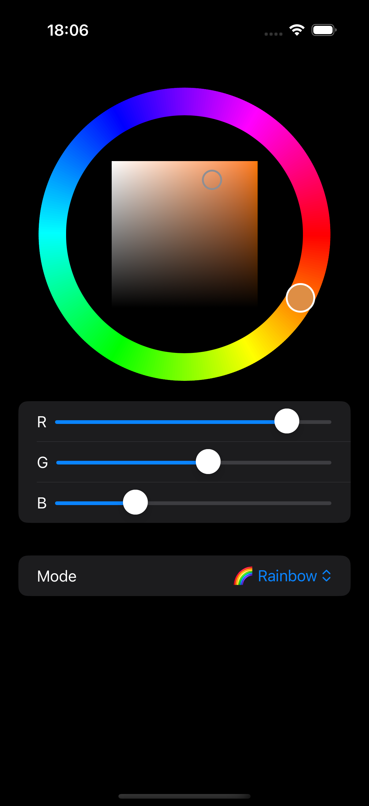
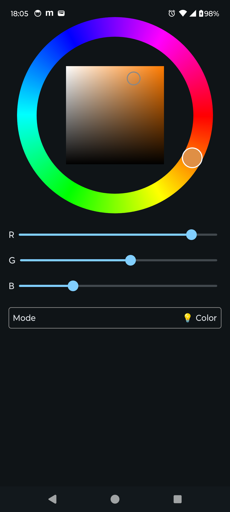

# LED Lamp App

A simple project using the ESP8266 to control a WS2812b LED strip with iOS and Android apps.

The wiring follows the default setup.

  
   

  | iOS                                    | Android |
  | :------------------------------------: | :----------------------------------------: |
  |  |  |
  

